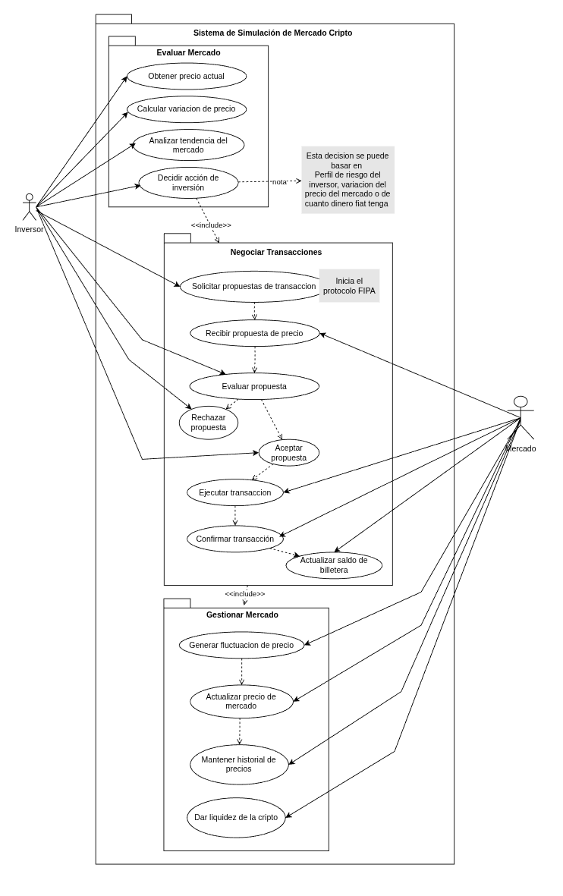
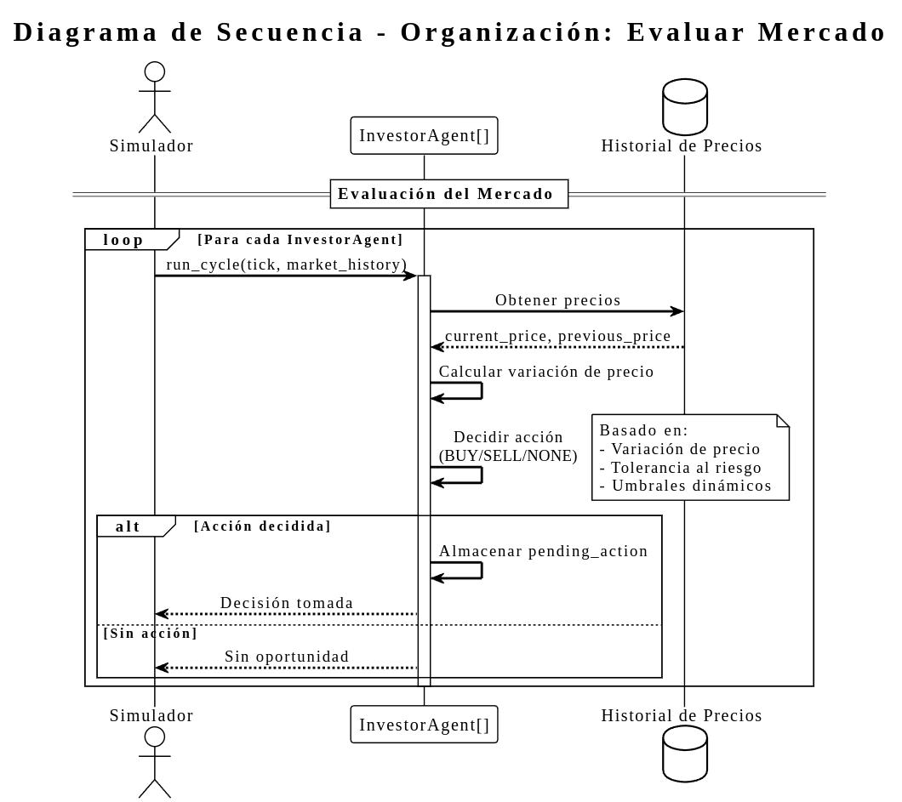
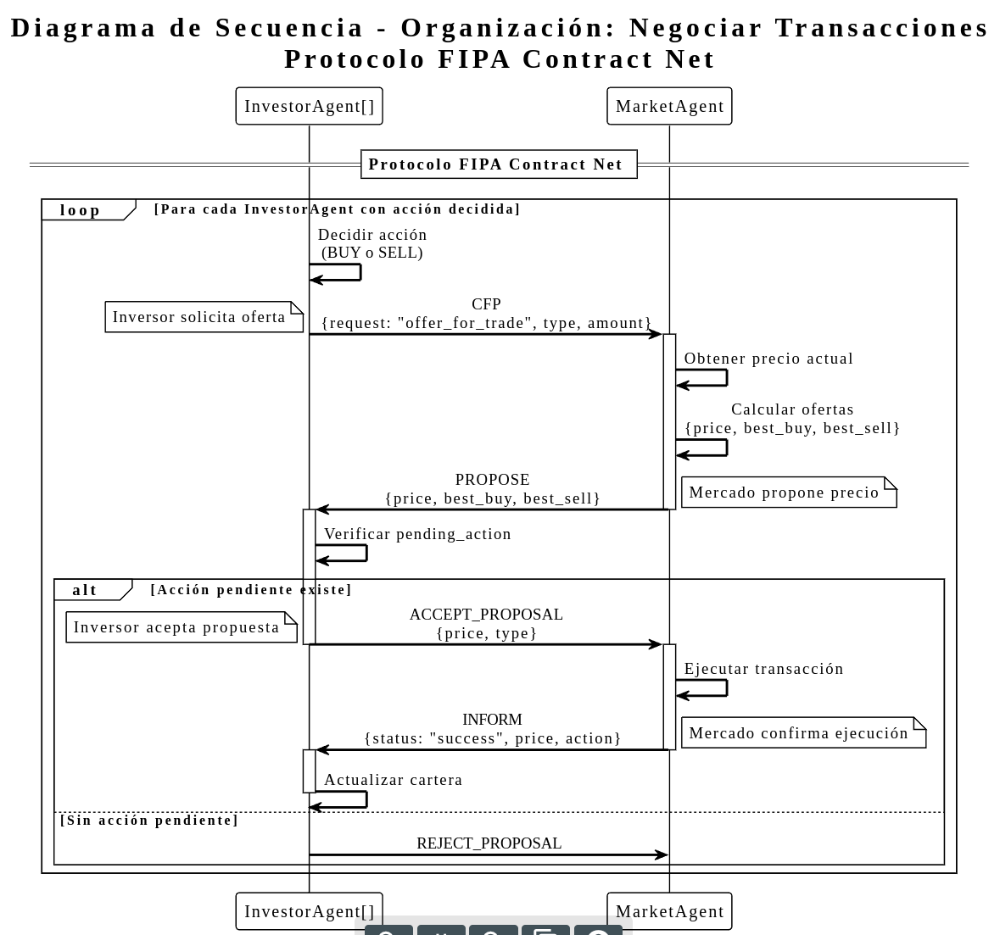
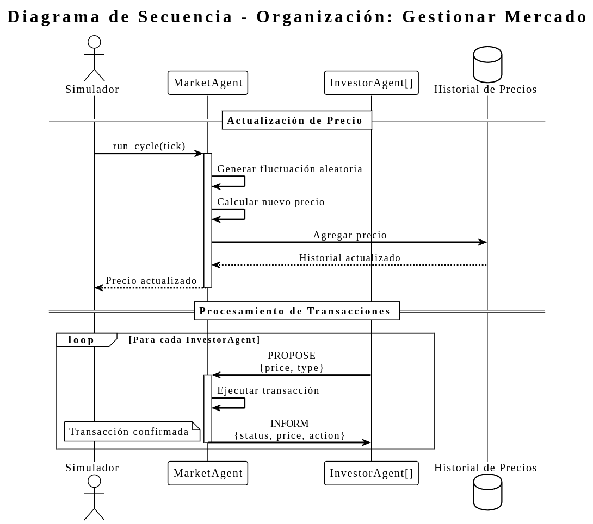

# 🚀 Simulador de Mercado Cripto 
## Inteligencia Artificial Distribuida 2025 - UTN FRT

**Alumno**: Sarmiento, Joaquín Esteban.

**Docente**: Dr. Araujo, Pedro Bernabé.

**Fecha**: 24/11/2025

---

## 1. Introducción

Este proyecto implementa un sistema multiagente para simular un mercado de criptomonedas donde agentes inversores autónomos toman decisiones de inversión basadas en su personalidad (tolerancia al riesgo) y negocian transacciones con un agente mercado utilizando el protocolo FIPA Contract Net Protocol (CNP).

El sistema demuestra conceptos fundamentales de Inteligencia Artificial Distribuida, incluyendo:
- **Comunicación entre agentes** mediante protocolos estandarizados (FIPA)
- **Autonomía y proactividad** de los agentes en la toma de decisiones
- **Organizaciones y roles** siguiendo la metodología ASPECS
- **Negociación automática** mediante protocolos de interacción

El proyecto incluye una interfaz web interactiva que permite visualizar las simulaciones en tiempo real, mostrando la evolución de precios, transacciones realizadas y el estado de los agentes.

---

## 2. Explicación del Proyecto

### 2.1. Arquitectura del Sistema

El sistema está compuesto por dos tipos principales de agentes:

#### **MarketAgent (Agente Mercado)**
- Simula el mercado de criptomonedas.
- Gestiona el precio actual de la cripto y su historial.
- Genera fluctuaciones aleatorias del precio (entre -5% y +5% por ciclo).
- Procesa solicitudes de transacción mediante el protocolo FIPA CNP.
- Ejecuta transacciones y confirma su realización.

#### **InvestorAgent (Agente Inversor)**
- Representa inversores con diferentes personalidades
- Evalúa el mercado y toma decisiones de inversión
- Negocia transacciones con el mercado
- Mantiene una cartera con saldos en fiat y criptomoneda
- Tres tipos de personalidades:
  - **Racional**: Baja tolerancia al riesgo (0.1) - Decisiones conservadoras
  - **Impulsivo**: Alta tolerancia al riesgo (0.6) - Reacciona rápidamente
  - **Medio**: Tolerancia media (0.3) - Balance entre conservador e impulsivo

### 2.2. Flujo de Funcionamiento

1. **Ciclo de Simulación**: En cada ciclo, el mercado actualiza el precio
2. **Evaluación**: Los inversores evalúan el cambio de precio y deciden si actuar
3. **Negociación**: Si un inversor decide actuar, inicia una negociación mediante CFP
4. **Protocolo FIPA CNP**: 
   - Inversor envía CFP (Call For Proposals)
   - Mercado responde con PROPOSE (propuesta de precio)
   - Inversor acepta o rechaza con ACCEPT_PROPOSAL o REJECT_PROPOSAL
   - Mercado ejecuta y confirma con INFORM
5. **Actualización**: Los inversores actualizan sus carteras según las transacciones

### 2.3. Sistema de Comunicación

El sistema utiliza un **MessageDispatcher** centralizado que:
- Gestiona una cola de mensajes entre agentes
- Enruta mensajes según el protocolo FIPA
- Permite comunicación asíncrona entre agentes
- Mantiene un historial de mensajes para depuración

---

## 3. Tecnologías Utilizadas

### Backend
- **Python 3.7+**: Lenguaje de programación principal
- **Flask 3.0.0**: Framework web para la interfaz
- **Collections (deque)**: Estructura de datos para cola de mensajes

### Frontend
- **HTML5**: Estructura de la interfaz web
- **CSS3**: Estilos y diseño responsive
- **JavaScript (ES6+)**: Lógica de interacción
- **Chart.js 4.4.0**: Gráficos interactivos para visualización de precios

### Metodología y Estándares
- **ASPECS**: Metodología para desarrollo de sistemas multiagente
- **FIPA Contract Net Protocol**: Protocolo estándar para negociación entre agentes
- **PlantUML**: Herramienta para generación de diagramas UML

### Arquitectura
- **Programación Orientada a Objetos**: Clases para agentes, capacidades y habilidades
- **Herencia Múltiple**: Agentes heredan capacidades (EvaluationCapacity, CommunicativeCapacity)
- **Patrón Singleton**: MessageDispatcher global
- **Protocolo de Mensajería**: Sistema de eventos basado en FIPA Performatives

---

## 4. Cómo Instalar y Ejecutar el Proyecto

### 4.1. Requisitos Previos

- Python 3.7 o superior
- pip (gestor de paquetes de Python)
- Navegador web moderno (Chrome, Firefox, Edge, etc.)

### 4.2. Instalación

1. **Clonar o descargar el proyecto**:
   ```bash
   cd /ruta/al/proyecto/simulador-mercado-cripto
   ```

2. **Instalar dependencias**:
   ```bash
   pip install -r requirements.txt
   ```

   Esto instalará:
   - Flask 3.0.0

3. **Verificar la estructura del proyecto**:
   ```
   tfi/
   ├── app.py              # Aplicación Flask
   ├── agents.py           # Definición de agentes
   ├── capacities.py       # Capacidades de agentes
   ├── events.py           # Eventos y mensajes FIPA
   ├── skills.py           # Habilidades de decisión
   ├── message_dispatcher.py  # Sistema de mensajería
   ├── requirements.txt    # Dependencias
   ├── templates/
   │   └── index.html      # Interfaz web
   └── static/
       ├── style.css       # Estilos
       └── script.js        # JavaScript
   ```

### 4.3. Ejecución

#### Modo Web (Recomendado)

1. **Iniciar el servidor Flask**:
   ```bash
   python app.py
   ```

2. **Abrir el navegador** en:
   ```
   http://localhost:5000
   ```

3. **Configurar la simulación**:
   - **Número de Ciclos**: Seleccionar entre 1 y 50 ciclos
   - **Precio Inicial**: Establecer el precio inicial de la criptomoneda (por defecto $100.00)

4. **Ejecutar simulación**:
   - Hacer clic en "Ejecutar Simulación"
   - Visualizar resultados en tiempo real:
     - Gráfico interactivo de evolución de precios
     - Estadísticas de la simulación
     - Estado de los agentes inversores
     - Lista de transacciones realizadas

### 4.4. Personalización

Se puede modificar los agentes en `app.py` para obtener distintos escenarios de mercado:

```python
# Crear inversores con diferentes características
inv_racional = InvestorAgent("InversorRacional_A", 
                            risk_tolerance=0.1, 
                            fiat_balance=1000.0, 
                            crypto_balance=10.0)
```

---

## 5. Artefactos

El proyecto incluye varios artefactos UML siguiendo la metodología ASPECS (Agent-oriented Software Process for Engineering Complex Systems).

### 5.1. Descripción de Requerimientos del Dominio (Organizaciones)

**Ubicación**: `uml/organizaciones.png`

<p align="center">
  
</p>

El diagrama muestra las **organizaciones** como paquetes, cada una con sus casos de uso específicos.

#### Organizaciones Identificadas:

##### 1. **Evaluar Mercado**
Organización donde los agentes inversores evalúan el precio del mercado y toman decisiones de inversión.

**Casos de Uso**:
- **UC1**: Obtener precio actual
- **UC2**: Calcular variación de precio
- **UC3**: Analizar tendencia del mercado
- **UC4**: Decidir acción de inversión

**Actor**: Inversor

##### 2. **Negociar Transacciones**
Organización donde se negocian y ejecutan transacciones entre inversores y el mercado, utilizando el protocolo FIPA Contract Net.

**Casos de Uso**:
- **UC5**: Solicitar propuesta de transacción (CFP)
- **UC6**: Recibir propuesta de precio (PROPOSE)
- **UC7**: Evaluar propuesta
- **UC8**: Aceptar propuesta (ACCEPT)
- **UC9**: Rechazar propuesta (REJECT)
- **UC10**: Ejecutar transacción
- **UC11**: Confirmar transacción (INFORM)
- **UC12**: Actualizar cartera

**Actores**: Inversor, Mercado

**Protocolo FIPA CNP**: CFP → PROPOSE → ACCEPT/REJECT → Ejecución → INFORM

##### 3. **Gestionar Mercado**
Organización donde el mercado gestiona el estado del precio, mantiene el historial y proporciona liquidez.

**Casos de Uso**:
- **UC13**: Actualizar precio de mercado
- **UC14**: Mantener historial de precios
- **UC15**: Generar fluctuación de precio
- **UC16**: Proporcionar liquidez

**Actor**: Mercado

#### Roles Identificados:

He definido varios roles que seguramente en la implementacion se usan en un mismo agente. Entre parentesis esta el agente que puede tomar ese rol.

- **Evaluador de Precio**: Evalúa cambios en el precio del mercado (InvestorAgent)
- **Decisor de Inversión**: Toma decisiones de compra/venta basadas en análisis (InvestorAgent)
- **Iniciador de Negociación**: Inicia el proceso de negociación mediante CFP (InvestorAgent)
- **Proponente**: Propone ofertas de transacción (MarketAgent)
- **Ejecutor de Transacción**: Ejecuta las transacciones acordadas (MarketAgent)
- **Gestor de Precio**: Gestiona la fluctuación y actualización de precios (MarketAgent)
- **Proveedor de Liquidez**: Proporciona liquidez para las transacciones (MarketAgent)

#### Agentes:

- **InvestorAgent**: Agente inversor que puede desempeñar múltiples roles según la organización.
- **MarketAgent**: Agente mercado que gestiona precios y procesa transacciones.


### 5.2. Diagrama de Ontologías

**Ubicación**: `uml/ontologia.png`

<p align="center">
  
</p>


El diagrama de ontología define los **conceptos** y **acciones** del dominio del sistema.

#### Conceptos Identificados:

1. **Inversor**
   - Representa a un agente inversor autónomo.
   - Se usa para simular la toma de decisiones de compra/venta según su perfil y tolerancia al riesgo.
2. **Mercado**
   - Entidad que simula el mercado de criptomonedas.
   - Se encarga de establecer y actualizar el precio, así como de ejecutar y registrar transacciones.
3. **CicloMercado**
   - Instancia temporal de operación del sistema (por ej un turno o ronda del mercado).
   - Se usa para agrupar los eventos y actualizaciones que ocurren en un ciclo de simulación (no sabia si dejarlo, pero al final lo termine usando en el código como un tick)
4. **Precio**
   - Valor actual de la criptomoneda.
   - Se utiliza para calcular transacciones y analizar tendencias de mercado.
5. **Propuesta**
   - Oferta enviada por un agente en el marco de una negociación.
   - Se usa en la interacción, por ejemplo, para proponer un precio de compra o venta.
6. **Transacción**
   - Operación donde se intercambia criptomoneda y dinero fiat.
   - Sirve para actualizar los balances de agentes y mercado, y registrar actividad.
7. **Billetera**
   - Entidad que contiene los activos (fiat y cripto) de cada agente.
   - Permite realizar transferencias durante las transacciones.
8. **Historial de Transacciones**
   - Registro de todas las operaciones realizadas entre agentes.
   - Se utiliza para poder ejecutar en bulk todas las transacciones. Ademas de poder hacer auditoría, análisis y visualización del sistema.
9. **Historial de Precios**
   - Registro cronológico de los valores de la criptomoneda.
   - Sirve para mostrar la evolución del mercado y apoyar las decisiones de inversión.
10. **MonedaCripto**
   - Representa la criptomoneda que es objeto de compra/venta en la simulación.
   - Se utiliza como unidad de intercambio entre inversores y mercado.
11. **CriterioNegociacion**
   - Estrategia o conjunto de reglas para negociar precios y cantidades.
   - Usado por los inversores para determinar si aceptan, rechazan o proponen una oferta.
12. **TipoOperacion**
   - Indica si una operación es de compra o de venta.
   - Determina el flujo de activos en la transacción.
13. **PrecioAcordado**
   - Valor final pactado en una negociación.
   - Se emplea para liquidar la operación según los acuerdos entre las partes.
14. **PerfilInversor**
   - Conjunto de características propias del inversor como su aversión al riesgo y comportamiento.
   - Ayuda a modelar diferentes tipos de inversores en la simulación.
15. **CriteriosDeAccion**
   - Reglas que sigue un inversor para decidir qué acción realizar.
   - Depende del tipo de transaccion, abajo se explican esos criterios.
16. **CriterioCompra**
   - Regla que especifica cuándo y cómo comprar criptomonedas.
   - Evita operaciones impulsivas e introduce lógica de entrada al mercado.
17. **CriterioVenta**
   - Condiciones bajo las cuales el agente decide vender.
   - Permite la toma de ganancias o limitación de pérdidas según parámetros definidos.
18. **CriterioNoHacerNada**
   - Condiciones para mantenerse inactivo durante un ciclo.
   - Útil para modelar estrategias conservadoras.
19. **ToleranciaRiesgo**
   - Parámetro que define la personalidad del inversor.
   - Determina las decisiones del inversor.
20. **CriterioCambioDePrecio**
   - Regla o condición que define la reacción de un agente ante cambios en el precio.
   - Se utiliza para disparar acciones como compras, ventas o no hacer nada.
21. **SaldoCripto**
   - Cantidad de criptomonedas que posee un agente.
   - Es utilizado para decidir si puede vender o requerir más compras.
22. **SaldoFiat**
   - Cantidad de moneda fiduciaria (ARS, USD, etc) disponible para el agente.
   - Es necesario para comprar criptomonedas y limita la capacidad de inversión.

#### Acciones Identificadas:

NOTA: se incluyen las acciones del diagrama de ontologia y de las clases de software en la implementacion de este repositorio. Las mismas fueron necesarias para la comunicacion entre agentes siguiendo el protocolo propuesto.

- Del diagrama de ontologías:
1. **Comprar**: Ejecuta una transacción de compra
2. **Vender**: Ejecuta una transacción de venta
4. **CambiarPrecio**: Actualiza el precio del mercado
5. **Evaluar**: Analiza el mercado para detectar oportunidades

- Resultado de la implementación:
6. **Decidir**: Determina el tipo de transacción a realizar
7. **Negociar**: Gestiona el proceso de negociación FIPA CNP
8. **Proponer**: Crea y envía propuestas de precio
9. **Aceptar**: Confirma propuestas y valida transacciones
10. **Rechazar**: Descarta propuestas u ofertas

### 5.3. Diagramas de Secuencia

Los diagramas de secuencia muestran la interacción temporal entre los participantes del sistema.

#### 5.3.1. Secuencia - Evaluar Mercado
**Ubicación**: `uml/secuencia_evaluar_mercado.png`

Muestra el proceso de evaluación del mercado por parte de los inversores.

<p align="center">
  
</p>


#### 5.3.2. Secuencia - Negociar Transacciones
**Ubicación**: `uml/secuencia_negociar_transacciones.png`

Muestra el protocolo FIPA Contract Net Protocol completo para negociar transacciones.

<p align="center">
  
</p>

#### 5.3.3. Secuencia - Gestionar Mercado
**Ubicación**: `uml/secuencia_gestionar_mercado.png`

Muestra el proceso de gestión del mercado.

<p align="center">
  
</p>

---

## 6. Conclusión

Este proyecto demuestra la implementación de un sistema multiagente utilizando:
- **Protocolos estándar** (FIPA Contract Net Protocol) para comunicación
- **Metodología ASPECS** para el diseño y análisis
- **Arquitectura orientada a agentes** con autonomía y proactividad
- **Visualización interactiva** de simulaciones complejas

El sistema permite estudiar el comportamiento de agentes con diferentes personalidades en un entorno de mercado simulado, proporcionando insights sobre cómo la tolerancia al riesgo afecta las decisiones de inversión.

---

## Referencias

- **FIPA Contract Net Protocol**: Foundation for Intelligent Physical Agents
- **ASPECS**: Agent-oriented Software Process for Engineering Complex Systems
- **PlantUML**: http://www.plantuml.com/
- **Flask Documentation**: https://flask.palletsprojects.com/
- **Chart.js**: https://www.chartjs.org/

---

